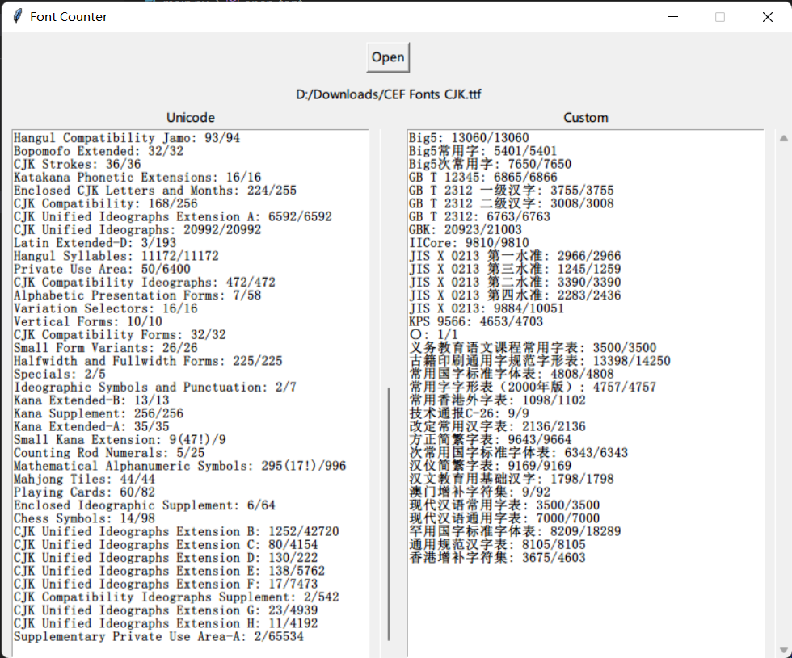

# Font Counter

A software that counts the number of characters in a font file grouped by Unicode blocks or custom character lists.

## Features

- Original Unicode data for Unicode blocks
- Built-in CJK text files for custom character list
- Generated mostly by ChatGPT, including this README file

## Requirements

- Python 3.x
- Tkinter
- fontTools

## Usage

1. Start the software by running the script `main.py`
2. Click on the “Open” button to select a font file
3. The Unicode and custom characters will be displayed in the corresponding text boxes

## Screenshot

Note: Example font in the screenshot is [CEF Fonts CJK](https://github.com/Partyb0ssishere/cef-fonts-cjk) version 2.04.

## Contributing

If you encounter any issues or have questions, feel free to open an issue. If you notice any errors in the default character lists, you can also submit a pull request to have it corrected. Your contribution is valuable and helps make the project better.

## Changelog

- 2023-02-11: Initial release of the Font Counter software.

## License

This software is licensed under the [MIT License](LICENSE).
